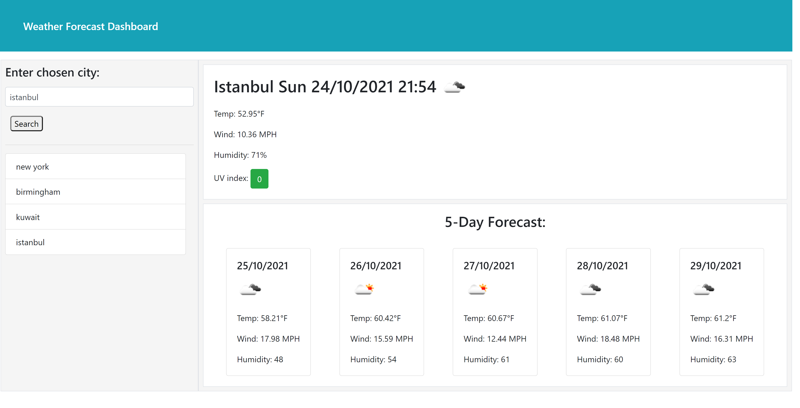

# Weather Dashboard 

## Overview

For this project my aim was to build a weather forecast webpage using OpenWeather One Call API.

Deployed Link: https://asmaamusse.github.io/weather-forecast-dashboard/

GitHub page:https://github.com/AsmaaMusse/weather-forecast-dashboard

### What did i do?

- I created a website using OpenWeather One Call API.
- I made sure the cities entered by the user would be rendered by the API
- The city search is saved in the LS and displayed onto the website for the user to see
- The website is also able to validate that the input is not empty.

### Technologies used:

- HTML
- CSS
- JavaScript
- JQuery

## Screenshots:

Final result

 Picture of the JS code

## Contribute

To contribute or ask questions, please <a href="https://mail.google.com/mail/u/0/?tf=cm&to=asmaamusse03@gmail.com&cc&bcc&su&body&fs=1">Email</a> here

